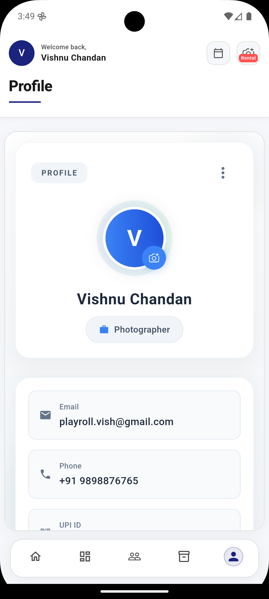
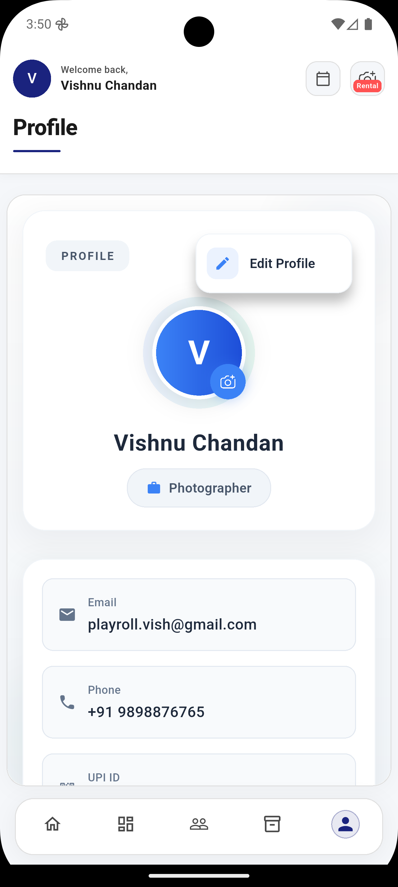
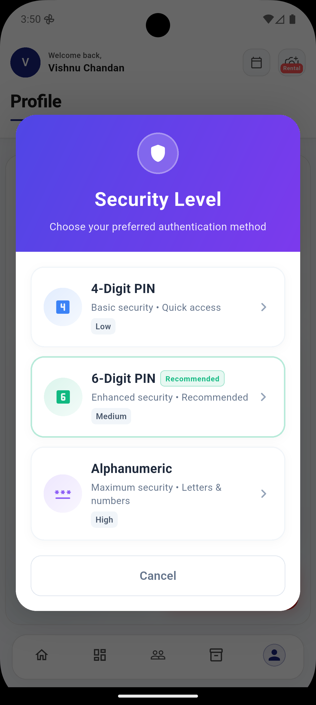

<h1 align="center">📒 BizMate</h1>
<h3 align="center">A Flutter-based billing and accounting app</h3>

  
  
  
  

<h2>🧾 About the App</h2>

<strong>BizMate</strong> is a Flutter application designed for small businesses, freelancers, and entrepreneurs to manage users, roles, customers, products, and invoices efficiently. It uses <strong>Hive</strong> for local offline-first storage and allows generating GST-compliant PDF invoices with embedded UPI QR codes.

<h2>🔧 Features</h2>
<ul>
  <li>Login with email/phone and passcode</li>
  <li>Android biometric authentication (Fingerprint/Face ID)</li>
  <li>Session management with auto-login</li>
  <li>Role selection during signup (Photographer, Sales, Manager, etc.)</li>
  <li>Manage users, products, and customers locally using Hive</li>
  <li>Create, edit, and manage GST-compliant invoices</li>
  <li>Generate and share PDF invoices with UPI QR codes</li>
  <li>Camera Rental module (available only for <strong>Photographer</strong> role)</li>
  <li>Offline-first functionality for fast performance</li>
</ul>

<h2>📁 Project Structure</h2>
<pre>
lib/
├── models/          # Hive data models (User, Product, Invoice)
├── screens/         # App screens (Login, Signup, Dashboard, AuthGate, Passcode)
├── widgets/         # Reusable UI components
├── services/        # Business logic (PDF, Invoice generation, UPI QR)
└── main.dart        # App entry point
assets/              # Images, icons, fonts
android/
ios/
web/
</pre>

<h2>🚀 Getting Started</h2>

<h3>Prerequisites</h3>
<ul>
  <li>Flutter 3.x or higher</li>
  <li>Dart 3.x</li>
  <li>Android 5.0+ for biometric authentication</li>
</ul>

<h3>Installation</h3>
<pre>
git clone https://github.com/Vishnu1017/BizMate.git
cd BizMate
flutter pub get
</pre>

<h3>Running the App</h3>
<pre>flutter run</pre>

<h3>Building Release Versions</h3>
<pre>
flutter build apk    # Android
flutter build ios    # iOS (requires Xcode)
flutter build web    # Web
</pre>

<h2>🛠️ Technologies Used</h2>

  
  
  
  

<h2>📈 Roadmap</h2>
<ul>
  <li>Multi-user support</li>
  <li>Cloud sync and backup (optional)</li>
  <li>Analytics dashboard for invoices and revenue</li>
  <li>Custom themes and branding options</li>
</ul>

<h2>👤 Author</h2>
<ul>
  <li>Vishnu Chandan</li>
  <li>GitHub: <a href="https://github.com/Vishnu1017">Vishnu1017</a></li>
  <li>Email: (playroll.vish@gmail.com)</li>
</ul>

<h2>📄 License</h2>

MIT License – see LICENSE file for details.

  <h2>📸 App Experience</h2>
  
A complete walkthrough of the system – sales, rentals, customers, and tools.

  <!-- Splash & Home -->
  

    

      🚀 Splash & Home 
    

    

      

      

      

    

  

  <!-- Items -->
  

    

      📦 Inventory 
    

    

      

      

      

    

  

  <!-- Sales -->
  

    

      💰 Sales 
    

    

      

      

      

      

      

    

  

  <!-- Rentals -->
  

    

      📷 Rentals 
    

    

      

      

      

      

      

      

      

    

  

  <!-- Customers -->
  

    

      👤 Customers 
    

    

      

      

    

  

  <!-- Profile -->
  

    

      🔐 Profile & Security 
    

    

      

      

      

    

  

